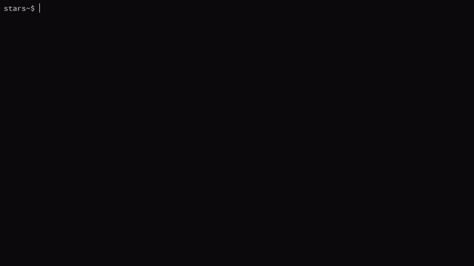

# tttoneliner
A one liner for an AI for Tic-Tac-Toe, with ~300 bytes.  
The current version of course, is only for the below gif
and is a dictionary lookup as I haven't implemented it
properly.
<br><br>


# pip
Make sure Python (> 3.10) is installed and added to path, as well as pip.  
To try it out for yourself,
```
pip install tttoneliner
```

As always, you can also
```
git clone https://github.com/alternyxx/tttoneliner
cd \tttoneliner\tttoneliner
pip install .
```

# Trying out
```
tttol
```
Runs the script and waits for an input.  
A board is like this-
```  
 1 │ 2 │ 3 
───┼───┼───  
 4 │ 5 │ 6 
───┼───┼───  
 7 │ 8 │ 9 
```
and you can type 5 to play in the middle, which should then
print out
```
 O │   │   
───┼───┼───
   │ X │
───┼───┼───
   │   │
```
The X is a move made by you and the O is made by the AI.  
For your fairness, there is a single way to beat it (at 
least from what I've discovered) and is totally not a bug.

# Explanation
```python
def main(B=111111111):{print('{}│{}│{}\n───┼───┼───\n{}│{}│{}\n───┼───┼───\n{}│{}│{}'.format(*['   'if i=='1'else' X 'if i=='2'else' O 'for i in str(B)]))for _ in range(5)if(B:=B+1*10**abs(9-int(input())))and(B:=B+2*10**boards[B])}
```